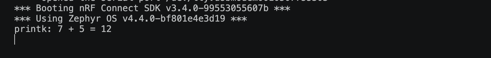
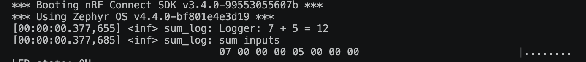
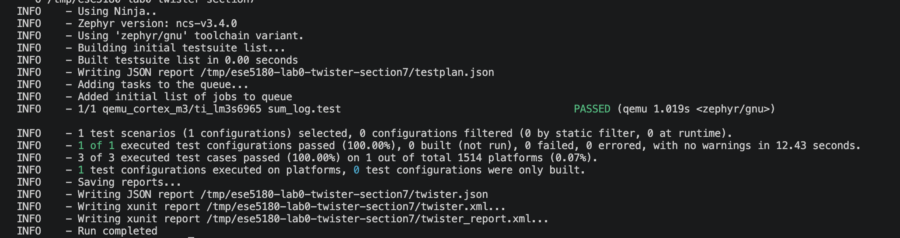
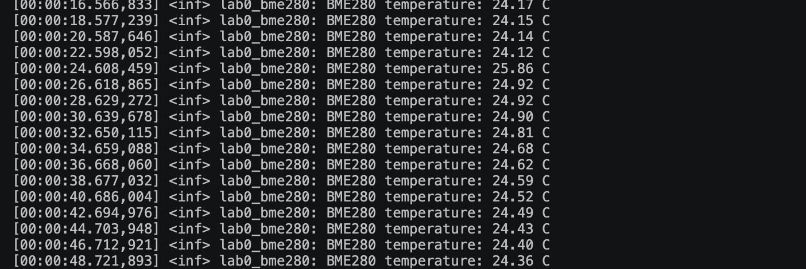
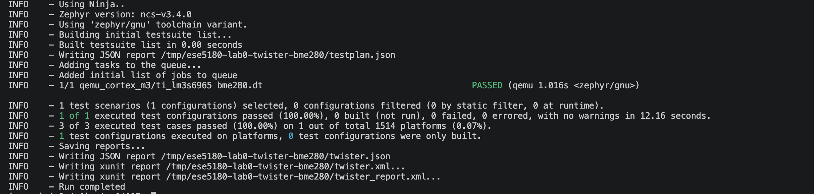

# ESE5180: Lab 0 Zephyr

| Team Member Name | Email Address                  |
| ---------------- | ------------------------------ |
| Fengyu Wu        | ericwu77@engineering.upenn.edu |

**GitHub Repository URL:** https://github.com/FengyuWu-77/lab0-zephyr-skeleton

## 1. Sample Header

## 2. Sample Second Header

## 3. Building and Flashing with West

The Nordic Zephyr application was built and flashed using West commands only,
without the graphical user interface.

### West build

The application was built for `nrf7002dk/nrf5340/cpuapp/ns` with Sysbuild.
The `BOARD_ROOT` option makes the application's board overlay available during
the build.


### West flash

The generated image was flashed with the J-Link runner.


### West command explanations

- `west init`: creates a West workspace and initializes its manifest.
- `west update`: downloads and synchronizes the repositories listed in the manifest.
- `west build`: configures and builds the application for the selected board.
- `west flash`: invokes the selected runner to program the built image.
- `--build-dir`: places generated build files in the specified out-of-tree directory.
- Application path: identifies the application source directory.
- `--pristine`: starts from a clean build directory.
- `--board`: selects the target board and processor variant.
- `--sysbuild`: builds the multi-image system, including TF-M and the application.
- `-DBOARD_ROOT`: specifies the directory containing application-specific board files.
- `--runner jlink`: selects the J-Link hardware programmer.

## 4. Kconfig

Kconfig is Zephyr's software configuration system. It controls operating-system
features, drivers, and application-specific settings. Device Tree describes the
hardware configuration, while Kconfig determines which software features are
enabled for the build.

### Kconfig questions

1. **What are the levels of log statements?**

   Zephyr's common log levels are error, warning, information, and debug. They
   represent increasing levels of detail. For example,
   `CONFIG_LOG_DEFAULT_LEVEL=3` enables the INFO level as the default level.
2. **What is the difference between `prj.conf` and `menuconfig`?**

   `prj.conf` is the application's text-based Kconfig input. It is easy to save,
   review, and track in Git. `menuconfig` is an interactive menu that helps the
   developer browse, enable, disable, and modify Kconfig options and their
   dependencies.
3. **How do you check that the symbols in `prj.conf` are set after building, and why?**

   After building, inspect the generated `.config` file in the build directory,
   such as `build/zephyr/.config`. This file contains the final resolved values
   after the application configuration, board defaults, Zephyr defaults, and
   Kconfig dependencies have been processed. Checking it confirms that the
   intended settings were actually applied and that no unexpected dependency or
   override changed the result.

## 5. Device Tree

Device Tree describes the hardware available to the application, including GPIO
controllers, LEDs, buttons, and their connections. The application accesses
these descriptions through generated macros instead of hard-coding GPIO numbers
in C code.

### LED and button aliases

The nRF7002 DK board defines its second LED as the Device Tree node `led1` and
its first button as `button0`. The application overlay creates project-specific
aliases for these nodes:

```dts
/ {
    aliases {
        led5180 = &led1;
        button5180 = &button0;
    };
};
```

The application accesses the aliases with `DT_ALIAS()` and obtains GPIO
specifications with `GPIO_DT_SPEC_GET()`. The LED is configured as an output,
the button is configured as an input, and the application polls the button. On
each new button press, the LED state is toggled.

An overlay is used instead of editing the upstream board `.dts` file because it
keeps application-specific hardware changes inside the application repository.
This avoids modifying the installed Zephyr/NCS source tree and makes the
configuration reproducible when the application is built on another machine or
with a different SDK installation.

## 6. Printing vs. Logging

This section implements the same two-integer sum through two build-time-selected
paths:

- `CONFIG_SUM_PRINT` builds `sum_printk/` and reports the result with `printk()`.
- `CONFIG_SUM_LOG` builds `sum_log/` and reports the result with Zephyr Logger.

The `sum_log/` implementation also emits an INFO-level hexdump of the two input
integers. The active implementation is selected by the Kconfig choice, while
`CMakeLists.txt` conditionally compiles only the selected source directory.

### Console evidence

The `printk` build produced the expected result:

```text
printk: 7 + 5 = 12
```



The Logger build produced an INFO-level result and a hexdump of the inputs:

```text
Logger: 7 + 5 = 12
sum inputs
07 00 00 00 05 00 00 00
```



### Discussion

| Topic | `printk()` | Logger |
|---|---|---|
| Performance | Synchronous output can block while characters are transmitted. | Deferred logging can reduce application blocking by buffering messages for later processing. |
| Flexibility | Simple console output with limited filtering and backend support. | Supports severity levels, filtering, multiple backends, timestamps, and hexdumps. |

Sourcing `Kconfig.zephyr` is necessary because it includes Zephyr's base Kconfig
configuration and dependency tree. Without it, the application's Kconfig file
would not be integrated with the standard Zephyr symbols and build configuration.

Deferred logging can be more suitable for embedded systems because application
code does not have to wait for every output byte to be transmitted. This can
improve timing and reduce blocking in time-sensitive code. The tradeoff is that
the Logger requires buffering resources and messages may be emitted later than
the code that generated them.

## 7. Ztest for Unit Testing

The test application is located in
`apps/nordic_blinky/tests/SUM_UNIT_TEST/`. It uses Zephyr's Ztest framework to
test the existing `sum_log()` implementation with three input classes:

- positive values: `2 + 3 = 5`;
- negative values: `-2 + -3 = -5`;
- zero values: `0 + 0 = 0`.

The test configuration enables Ztest, verbose assertion messages, and Logger:

```text
CONFIG_ZTEST=y
CONFIG_ZTEST_ASSERT_VERBOSE=2
CONFIG_LOG=y
```

The test was run on the QEMU Cortex-M3 simulator with:

```bash
west twister \
  -T apps/nordic_blinky/tests/SUM_UNIT_TEST \
  -p qemu_cortex_m3 \
  --inline-logs -v
```

The result was one passing test configuration and three passing test cases:

```text
1 of 1 executed test configurations passed (100.00%)
3 of 3 executed test cases passed (100.00%)
```



### Ztest execution model

The test source does not define a traditional application `main()` function.
The Ztest framework supplies the test runner entry point, registers the suite
with `ZTEST_SUITE()`, and invokes each `ZTEST()` case. This allows the same test
application to initialize Zephyr and run the registered test cases automatically.

### `west twister` versus `west build`

| Command | Purpose | Preferred situation |
|---|---|---|
| `west build` | Builds one explicitly selected test application for one board. | Use when debugging a single test build or inspecting generated files. |
| `west twister` | Discovers test cases from `testcase.yaml`, builds them for selected platforms, runs them when supported, and reports results. | Use for automated test execution, multiple tests, or multiple platforms. |

## 8. Adding a Peripheral (BME280)

The BME280 is connected to the nRF7002 DK through I²C1. Following the lab
hardware table, the connections are `VCC -> VDD`, `GND -> GND`, `SDA -> P1.15`,
and `SCL -> P1.14`. The BME280 uses its default I²C address `0x77`.

### Device Tree and Kconfig

The application enables the sensor and I²C subsystems in `prj.conf`:

```conf
CONFIG_SENSOR=y
CONFIG_I2C=y
```

The application overlay enables `i2c1`, creates the `bme280_lab` node with
`compatible = "i2c-device"` and `reg = <0x77>`, and overrides the board's
default I²C pins with `SDA=P1.15` and `SCL=P1.14`.

Because this application uses the non-secure nRF5340 target, TF-M's default
secure UART configuration also had to be disabled. TF-M UART1 shares a
peripheral ID with TWIM1, so leaving the secure UART enabled caused a BusFault
when the non-secure application initialized I²C1:

```conf
CONFIG_TFM_SECURE_UART=n
CONFIG_TFM_LOG_LEVEL_SILENCE=y
```

### 8.1 Direct BME280 temperature read

The lab asks for direct register access instead of Zephyr's plug-and-play BME280
driver. The application obtains the bus with `I2C_DT_SPEC_GET(DT_NODELABEL(bme280_lab))`,
reads the temperature calibration values from registers `0x88` through `0x8D`,
writes `0x27` to `CTRL_MEAS` at register `0xF4`, and reads the raw temperature
value from `TEMP_MSB` at `0xFA`. The Bosch integer compensation formula converts
the raw value into degrees Celsius with hundredths-of-a-degree precision.

The firmware logs a new temperature approximately every two seconds. The
hardware output below shows continuous readings between approximately
`24.12 °C` and `24.92 °C`:

```text
[00:00:16.566,833] <inf> lab0_bme280: BME280 temperature: 24.17 C
[00:00:18.577,239] <inf> lab0_bme280: BME280 temperature: 24.15 C
[00:00:24.608,459] <inf> lab0_bme280: BME280 temperature: 25.08 C
[00:00:30.639,678] <inf> lab0_bme280: BME280 temperature: 24.90 C
[00:00:48.721,893] <inf> lab0_bme280: BME280 temperature: 24.36 C
```



### 8.2 Device Tree sanity test

The `apps/nordic_blinky/tests/BME280_DT_TEST/` test is intentionally
hardware-independent. Its QEMU-only overlay provides a virtual I²C controller
and a BME280-compatible `i2c-device` node, allowing the test to check the
Device Tree structure without accessing a physical sensor. The three Ztest
cases verify that the node exists, is enabled, and has the expected address
`0x77`.

The test was run with:

```bash
west twister \
  -T apps/nordic_blinky/tests/BME280_DT_TEST \
  -p qemu_cortex_m3 \
  --inline-logs -v \
  -O /tmp/ese5180-lab0-twister-bme280
```

The result was one passing test configuration and three passing test cases:

```text
1 of 1 executed test configurations passed (100.00%)
3 of 3 executed test cases passed (100.00%)
```



## Environment Baseline

| Item             | Value                               |
| ---------------- | ----------------------------------- |
| Host OS          | macOS                               |
| Python           | 3.12.14                             |
| West             | 1.5.0                               |
| CMake            | 4.3.1                               |
| Ninja            | 1.13.2                              |
| QEMU             | 11.1.1                              |
| Zephyr workspace | `/Users/ericcc/zephyrproject`     |
| Zephyr revision  | v4.4.0                              |
| Nordic NCS       | v3.4.0 (`/opt/nordic/ncs/v3.4.0`) |

Build directories are kept outside this repository. Vanilla Zephyr build/flash verification will start with the XIAO nRF52840 Sense and STM32 Nucleo F411RE. The nRF7002 DK target must use the course-required Nordic NCS 3.4.x environment.
