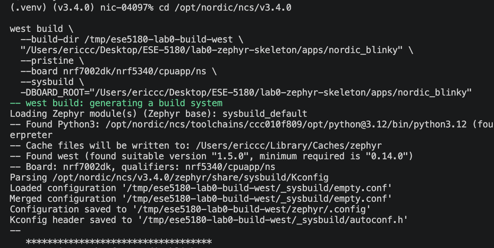
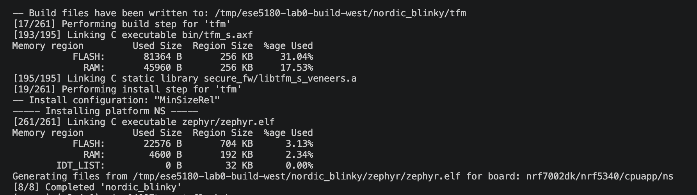
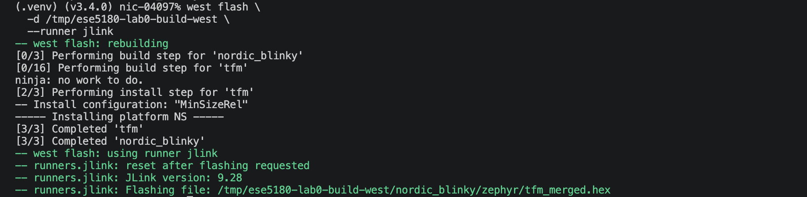

# ESE5180: Lab 0 Zephyr

| Team Member Name | Email Address                  |
| ---------------- | ------------------------------ |
| Fengyu Wu        | ericwu77@engineering.upenn.edu |

**GitHub Repository URL:** https://github.com/FengyuWu-77/lab0-zephyr-skeleton

## 1. Sample Header

## 2. Sample Second Header

## 3. Building and Flashing with West

The Nordic Zephyr application was built and flashed using West commands only,
without the graphical user interface.

### West build

The application was built for `nrf7002dk/nrf5340/cpuapp/ns` with Sysbuild.
The `BOARD_ROOT` option makes the application's board overlay available during
the build.





### West flash

The generated image was flashed with the J-Link runner.



### West command explanations

- `west init`: creates a West workspace and initializes its manifest.
- `west update`: downloads and synchronizes the repositories listed in the manifest.
- `west build`: configures and builds the application for the selected board.
- `west flash`: invokes the selected runner to program the built image.
- `--build-dir`: places generated build files in the specified out-of-tree directory.
- Application path: identifies the application source directory.
- `--pristine`: starts from a clean build directory.
- `--board`: selects the target board and processor variant.
- `--sysbuild`: builds the multi-image system, including TF-M and the application.
- `-DBOARD_ROOT`: specifies the directory containing application-specific board files.
- `--runner jlink`: selects the J-Link hardware programmer.

## 4. Kconfig

Kconfig is Zephyr's software configuration system. It controls operating-system
features, drivers, and application-specific settings. Device Tree describes the
hardware configuration, while Kconfig determines which software features are
enabled for the build.

### Kconfig questions

1. **What are the levels of log statements?**

   Zephyr's common log levels are error, warning, information, and debug. They
   represent increasing levels of detail. For example,
   `CONFIG_LOG_DEFAULT_LEVEL=3` enables the INFO level as the default level.
2. **What is the difference between `prj.conf` and `menuconfig`?**

   `prj.conf` is the application's text-based Kconfig input. It is easy to save,
   review, and track in Git. `menuconfig` is an interactive menu that helps the
   developer browse, enable, disable, and modify Kconfig options and their
   dependencies.
3. **How do you check that the symbols in `prj.conf` are set after building, and why?**

   After building, inspect the generated `.config` file in the build directory,
   such as `build/zephyr/.config`. This file contains the final resolved values
   after the application configuration, board defaults, Zephyr defaults, and
   Kconfig dependencies have been processed. Checking it confirms that the
   intended settings were actually applied and that no unexpected dependency or
   override changed the result.

## 5. Device Tree

Device Tree describes the hardware available to the application, including GPIO
controllers, LEDs, buttons, and their connections. The application accesses
these descriptions through generated macros instead of hard-coding GPIO numbers
in C code.

### LED and button aliases

The nRF7002 DK board defines its second LED as the Device Tree node `led1` and
its first button as `button0`. The application overlay creates project-specific
aliases for these nodes:

```dts
/ {
    aliases {
        led5180 = &led1;
        button5180 = &button0;
    };
};
```

The application accesses the aliases with `DT_ALIAS()` and obtains GPIO
specifications with `GPIO_DT_SPEC_GET()`. The LED is configured as an output,
the button is configured as an input, and the application polls the button. On
each new button press, the LED state is toggled.

An overlay is used instead of editing the upstream board `.dts` file because it
keeps application-specific hardware changes inside the application repository.
This avoids modifying the installed Zephyr/NCS source tree and makes the
configuration reproducible when the application is built on another machine or
with a different SDK installation.

## Environment Baseline

| Item             | Value                               |
| ---------------- | ----------------------------------- |
| Host OS          | macOS                               |
| Python           | 3.12.14                             |
| West             | 1.5.0                               |
| CMake            | 4.3.1                               |
| Ninja            | 1.13.2                              |
| QEMU             | 11.1.1                              |
| Zephyr workspace | `/Users/ericcc/zephyrproject`     |
| Zephyr revision  | v4.4.0                              |
| Nordic NCS       | v3.4.0 (`/opt/nordic/ncs/v3.4.0`) |

Build directories are kept outside this repository. Vanilla Zephyr build/flash verification will start with the XIAO nRF52840 Sense and STM32 Nucleo F411RE. The nRF7002 DK target must use the course-required Nordic NCS 3.4.x environment.
